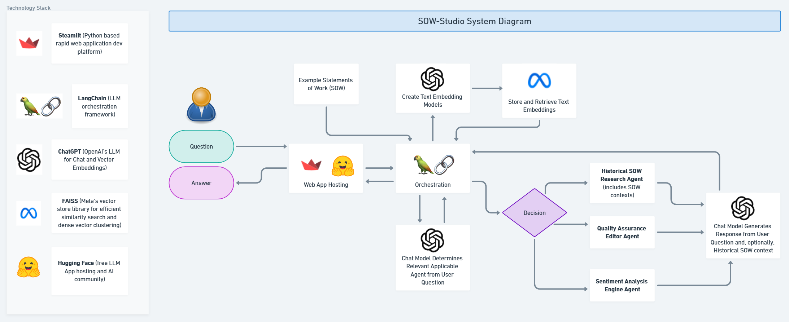

# SOW-Studio

## Introduction

Welcome to SOW-Studio, an open-source software tool specifically designed for IT consulting firms to improve the creation and accuracy of Statements of Work (SOW)s. Utilizing advanced Large Language Model (LLM) technology, SOW-Studio offers a suite of features aimed at enhancing the efficiency, consistency, and quality of SOW documents.

## Features

- **LLM-Based Authoring:** Leverages a ChatGPT to assist in drafting SOWs by providing contextually relevant suggestions based on your vast database of high-quality SOW examples.
- **Quality Assurance:** Integrates a grammar and consistency checklist to ensure each SOW meets high standards of professionalism and accuracy.
- **Sentiment Analysis Engine:** Analyzes the tone and sentiment of the SOW to maintain positive and professional client interactions.
- **Historical SOW Researcher:** Utilizes retrieval-augmented generation to reference previous successful SOWs to guide the creation of new documents.
- **Few-shot and Chain of Thought Prompting:** Employs examples of advanced prompting techniques to generate precise and contextually appropriate content.

## Benefits

- **Reduce Errors and Inconsistencies:** Minimize common mistakes in SOWs that can lead to client disputes, project delays, or financial losses.
- **Increase Efficiency:** Streamline the SOW creation process, allowing consultants to draft documents faster without compromising on quality.
- **Scale SOW Authoring:** Enable a consistent level of professionalism across all SOWs drafted within the organization, regardless of the consultant's experience level.

## System Diagram

## Getting Started

To start using SOW-Studio, clone the repository and follow these installation instructions:

0. Run the command `pip install -r requirements.txt`
1. Add a .env file with a single ChatGPT API Key line like below:
`OPENAI_API_KEY=sk-yourkeyhere`
2. Load up the `/input_data/` folder with your high-quality historical SOWS.  They must be .txt files.
3. Run the app locally using the command  `streamlit run app.py`
4. Or run using Docker and these 2 commands :
  * `docker build -t SOW-Studio .`
  * `docker run -p 7860:7860 SOW-Studio`
  

## License
SOW-Studio is released under the MIT License. Do as you please with it!

## Authors
Michael Ellis - Initial Work - https://www.linkedin.com/in/mike-a-ellis/

## Acknowledgements
Thanks to all contributors who provided valuable feedback.

Contact
For support or general inquiries, contact me at https://www.linkedin.com/in/mike-a-ellis/